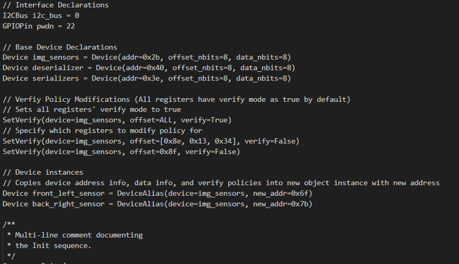
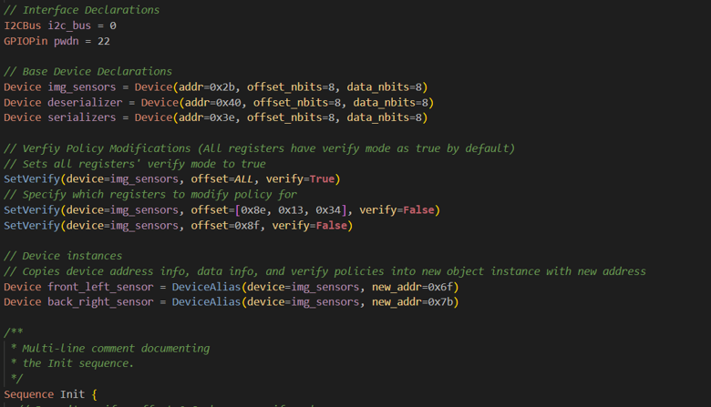
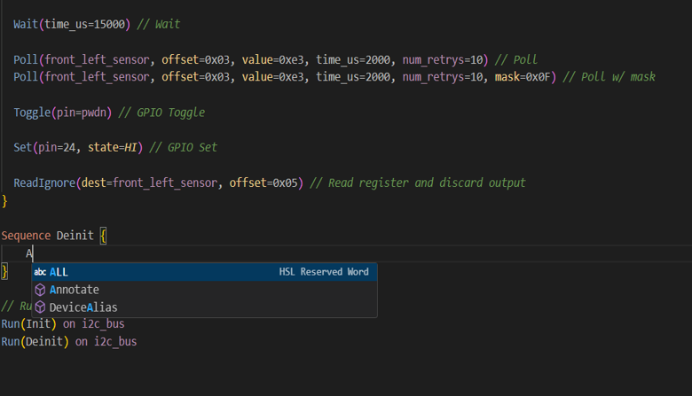
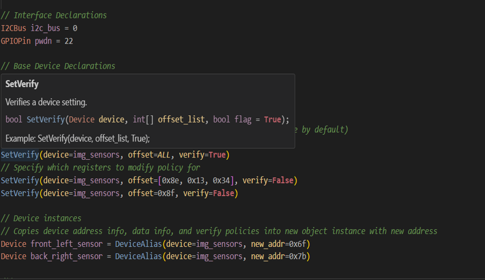
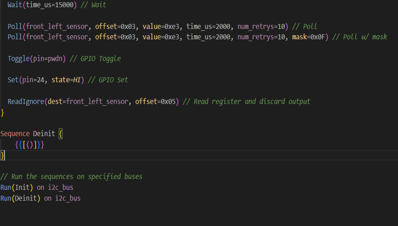

# HSL IDE Components – VSCode Extension

## 📌 Overview

The **HSL IDE Components** project is a custom **Visual Studio Code extension** created using the **Yo Code generator** to provide complete development support for **HSL (Hardware Sequence Language)**.
It integrates intelligent editing, compiler support, debugging, and real-time diagnostics to enhance productivity for hardware engineers working with HSL.

---

## 🛠 About Yo Code Generation Tool

The **Yo Code generator** is a scaffolding tool provided by Microsoft to quickly create the structure for a VS Code extension. It is built on **Yeoman**, a popular code generator framework, and simplifies the process of setting up a new extension project with all required configuration files and boilerplate code.

**How it is used in this project:**

1. **Project Initialization** – The `yo code` command was used to create the base project folder structure, including `package.json`, activation scripts, command registration, and contribution points.
2. **Language Configuration** – Configurations for `.hsl` files were added to enable syntax highlighting, hover information, and diagnostics.
3. **API Integration** – The generated code was extended using VS Code APIs to implement features like IntelliSense, compiler hooks, and debugging tools.
4. **Testing Environment** – The Yo Code scaffold includes a ready-to-use debug configuration, making it easy to run and test the extension in an **Extension Development Host** window.

**Key Uses of Yo Code in Development:**

* Rapidly scaffolding a working extension framework.
* Automatically generating command and activation event handlers.
* Managing the `contributes` section in `package.json` for editor integration.
* Providing a ready-to-run development environment for faster testing.

---

## 🎯 Problem Statement

Hardware engineers working with **HSL** lacked an integrated development environment that could provide syntax awareness, intelligent recommendations, debugging capabilities, and compiler integration within a single editor.
This project addresses that gap by delivering an **all-in-one VS Code extension** tailored for HSL development.

---

## 🚀 Features

* **Syntax Highlighting** – Clear, color-coded representation of HSL keywords, variables, and operators.
* **Syntax Recommendations** – Intelligent suggestions to reduce syntax errors and improve coding speed.
* **Auto-completion** – Context-aware completion for functions, keywords, and variables.
* **Error Detection & Diagnostics** – Real-time feedback and detection of multiple errors in a single compilation cycle.
* **Compiler Integration** – Cross-platform support for executing and compiling HSL code.
* **Debugging Tools** – Integrated OPAL-based debugging for dynamic policy management and decision-making.
* **Hover Provider** – Displays detailed contextual information on hover.

---

## 🛠 Tools & Technologies

* **Visual Studio Code API** – Core API for building and extending VS Code functionality.
* **Yo Code Generator (Yeoman)** – Tool used to scaffold the extension’s base structure.
* **TypeScript** – Language used to implement extension logic with strong typing.
* **OPAL** – Enables real-time debugging and decision-making integration.
* **Cross-Platform Compiler** – Supports compilation on different operating systems.

---

## 📐 Methodology

1. **Extension Scaffolding** – Used the Yo Code generator to create the project’s initial file and folder structure.
2. **Language Configuration** – Defined `.hsl` file syntax rules and tokenization for highlighting.
3. **Feature Development** – Implemented IntelliSense, hover provider, and error diagnostics using VS Code APIs.
4. **Compiler Integration** – Linked cross-platform compiler to enable compilation from within VS Code.
5. **Debugging Integration** – Integrated OPAL for real-time debugging support.
6. **Testing & Validation** – Verified the extension across operating systems to ensure compatibility and performance.

---

## 🖼 Implementation (Screenshots & Diagrams)

Below are the suggested images and captions to visually represent the project:

1. **Pre-Implementation**
   *Initial setup and project scaffolding created using the Yo Code generator before feature integration.*

   ```markdown
   
   ```

2. **Syntax Highlighting**
   *Screenshot of an `.hsl` file in VS Code with clear syntax highlighting for keywords, variables, and operators.*

   ```markdown
   
   ```

3. **Syntax Recommendation**
   *Example showing context-aware syntax recommendations to improve code accuracy and speed.*

   ```markdown
   
   ```

4. **Hover Tooltip**
   *Hovering over code elements to display detailed information such as descriptions, parameters, or usage.*

   ```markdown
   
   ```

5. **Syntax Completion**
   *Auto-completion suggestions appearing in real time while typing HSL code.*

   ```markdown
   
   ```

